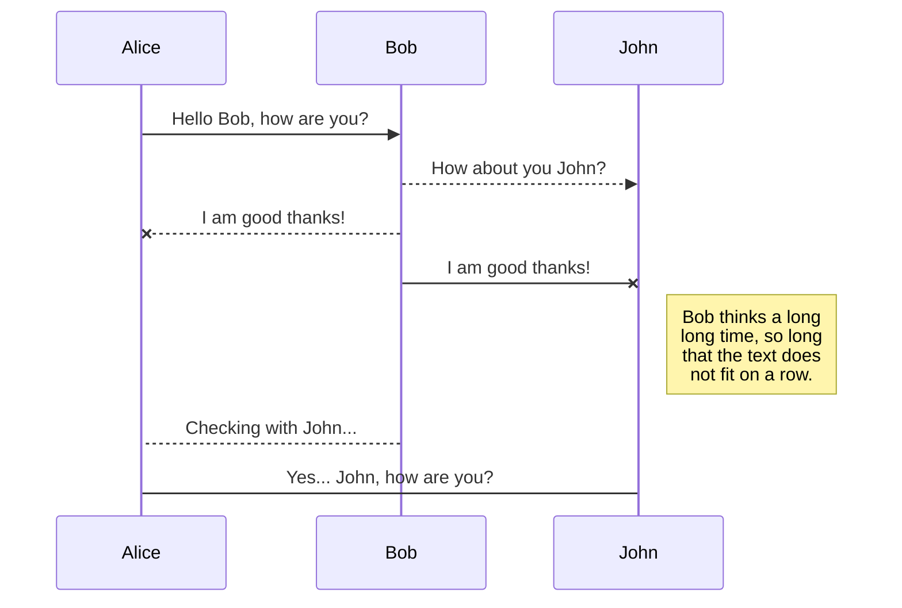
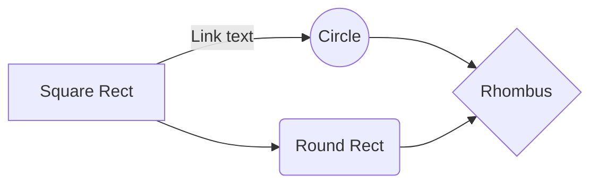

# Base App with Marvel App example 

Welcome to the android app developed in **Kotlin**. This app uses as a base a previous development that forms the basis of it.
Its simple operation is described below:

## Functioning

Our app will take the data from the web 
>"https://gateway.marvel.com/".

This website allows us to register as a user and use the api for free up to 3000 calls per day.
To make use of the requests it is necessary with our registration in it to obtain the private and public keys, necessary for each request.

### Screens
The app shows a list of characters from the Marvel universe, which we can select to see their image a little larger and, if it has one, a brief description.

The app obtains a total of  **20** records from the api, but we can add 20 more in each search and store them within it. To do this, simply go down to the last record in the list, pull a little more and release the list, it will notify us with a  **loading** that the list is increasing.

Another of the tools that the app has is the possibility of **searching for a specific character** by the content of its name. To do this we will use the search bar that is hidden by default. In order to view it, we navigate through our list to the first record and pull down; We will then see how a space appears to be able to write with two buttons. If we write a name and click on the button with the drawing of a  **magnifying glass **, the search will be carried out, filtering the list with the records that contain said text (being in filter mode we will not be able to update the list with more characters). The other button with a  **x symbol** allows us to quickly erase the name that we have written and recover the complete list.
Finally, to hide the search bar, just navigate down it.

|                |ASCII                          |HTML                         |
|----------------|-------------------------------|-----------------------------|
|Single backticks|`'Isn't this fun?'`            |'Isn't this fun?'            |
|Quotes          |`"Isn't this fun?"`            |"Isn't this fun?"            |
|Dashes          |`-- is en-dash, --- is em-dash`|-- is en-dash, --- is em-dash|

> You can find more information about **LaTeX** mathematical expressions [here](http://meta.math.stackexchange.com/questions/5020/mathjax-basic-tutorial-and-quick-reference).

And this will produce a flow chart:

